# Distributed File Storage System

A high-performance, fault-tolerant distributed file storage system built in Go with comprehensive monitoring and testing capabilities.

## 🏗️ Architecture

```mermaid
graph TD
    client_apps["Client Applications"]
    coordinator["Coordinator (Port 8080)"]
    client_apps -->|HTTP Requests| coordinator

    %% --- Define the four storage nodes ---
    subgraph "Storage Node 1 (Port 8081)"
        node1["• File Chunk Storage<br>• Local Health Checks<br>• Replication Handling<br>• Metadata Sync"]
    end
    subgraph "Storage Node 2 (Port 8082)"
        node2["• File Chunk Storage<br>• Local Health Checks<br>• Replication Handling<br>• Metadata Sync"]
    end
    subgraph "Storage Node 3 (Port 8083)"
        node3["• File Chunk Storage<br>• Local Health Checks<br>• Replication Handling<br>• Metadata Sync"]
    end
    subgraph "Storage Node 4 (Port 8084)"
        node4["• File Chunk Storage<br>• Local Health Checks<br>• Replication Handling<br>• Metadata Sync"]
    end

    %% --- Define the monitoring components ---
    subgraph "Monitoring & Observability Layer"
        monitor["Monitoring & Observability Layer"]
        prom["Prometheus (Port 9090)"]
        grafana["Grafana (Port 3000)"]
        loki["Loki (Port 3100)"]
        promtail["Promtail (Log Shipper)"]
        monitor --> prom & grafana & loki & promtail
    end

    %% --- Link components and control layout ---
    
    %% Create two columns to form the grid
    coordinator --> node1 --> node3
    coordinator --> node2 --> node4

    %% Connect the bottom row of nodes to the monitoring layer
    node3 --> monitor
    node4 --> monitor

    %% Make the layout-guiding links invisible
    %% NOTE: Link indices start at 0 and are based on definition order.
    %% Link 2: node1 --> node3
    %% Link 4: node2 --> node4
    %% Link 5: node3 --> monitor
    %% Link 6: node4 --> monitor
    linkStyle 2 stroke-width:0px
    linkStyle 4 stroke-width:0px
    linkStyle 5 stroke-width:0px
    linkStyle 6 stroke-width:0px
```


### Key Features
- **Distributed Storage**: Files are split into chunks and distributed across 4 storage nodes
- **Fault Tolerance**: 3x replication factor ensures data availability even with node failures
- **Load Balancing**: Intelligent distribution of chunks across storage nodes
- **Health Monitoring**: Continuous health checks with automatic failure detection
- **Circuit Breaker**: Automatic recovery and fallback mechanisms
- **Metrics & Monitoring**: Real-time metrics collection with Prometheus and Grafana
- **Logging**: Centralized logging with Loki and Promtail


## 🚀 Quick Start

### Prerequisites

- Docker and Docker Compose
- Go 1.19+ (for development)
- 8GB RAM recommended
- Ports 8080-8084, 3000, 9090, 3100 available

### 1. Start the Application
``` bash
# Clone the repository
git clone <repository-url>

#Start main-coordinator and individual storage servers in separate terminals

#Start main-coordinator
cd backend/cmd/server/main.go
go run main.go

#Start Server 1
cd backend/internal/distributedServers/server1
go run main.go

#Start Server 2
cd backend/internal/distributedServers/server2
go run main.go

#Start Server 3
cd backend/internal/distributedServers/server3
go run main.go

#Start Server 4
cd DistributedFileStorage/backend/internal/distributedServers/server4
go run main.go
 ```
# Verify services are running
- You will see health checks in main-coordinator and for all 4 individual servers


**Services will be available at:**
- **Coordinator**: http://localhost:8080
- **Storage Node 1**: http://localhost:8081
- **Storage Node 2**: http://localhost:8082
- **Storage Node 3**: http://localhost:8083
- **Storage Node 4**: http://localhost:8084

### 2. Start Monitoring Stack

```bash
# Start monitoring services
./start-monitoring.sh

**Monitoring URLs:**
- **Grafana Dashboard**: http://localhost:3000 (admin/admin)
- **Prometheus**: http://localhost:9090
- **Loki**: http://localhost:3100

### CLI Flags

```bash
# By default only error level logs are enabled. For verbose logging pass loglevel cli flag
-loglevel info                    # Log level (debug, info, warn, error)
```


### Automated Monitoring

The system includes built-in health monitoring:
- **Health Check Frequency**: Every 30 seconds
- **Failure Detection**: Automatic node failure detection
- **Circuit Breaker**: Automatic fallback and recovery

## 🛠️ API Usage

### Upload File

```bash
curl -X POST \
  -F "file=@example.txt" \
  -F "filename=example.txt" \
  http://localhost:8080/upload
```

### Download File

```bash
curl -X GET \
  -o downloaded_file.txt \
  "http://localhost:8080/download?filename=example.txt&version=1"
```

### List Files

```bash
curl -X GET http://localhost:8080/files
```

### Delete File

```bash
curl -X DELETE "http://localhost:8080/delete?filename=example.txt"
```